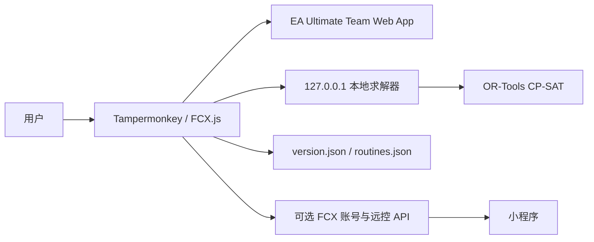
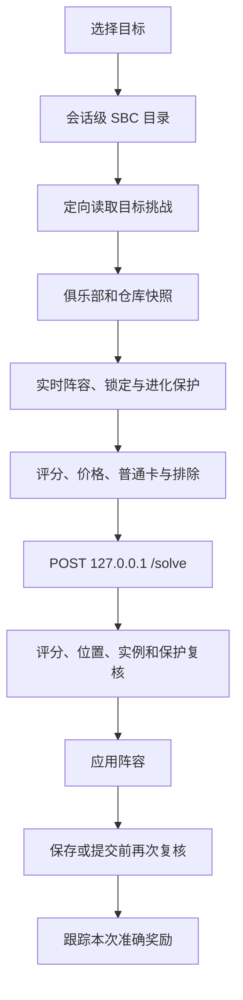

# FCX 开发者文档

本文是 FCX 的统一开发与维护入口，涵盖架构、环境、EA 兼容、本地后端接口、测试、构建和发布。提交代码前还应阅读 [贡献指南](../CONTRIBUTING.md) 和 [安全策略](../SECURITY.md)。

## 设计目标与系统边界

FCX 的核心目标是在不把完整球员池和求解请求发送到远程 FCX 服务的前提下，为 EA Ultimate Team Web App 提供本地 SBC 求解、任务自动化和球员保护。

设计原则：

- 求解只在用户本机完成。
- 用户脚本不动态下载或执行远程 JavaScript。
- 写操作优先保证不重复提交、开包、移动或出售。
- 保护数据和写操作结果无法确认时停止，不猜测性继续。
- 远程 JSON 只能描述白名单动作，不能包含代码、HTML 或任意 URL。
- EA 私有对象变化尽量由兼容层吸收，不为修复单个页面覆盖无关全局原型。



本仓库包含用户脚本、本地求解后端、测试、构建与发布配置；不包含远程 API 服务端、小程序、线上数据库、Redis 或用户数据。

## 环境准备

### 用户脚本

要求 Node.js `>=20.19.0`、npm 和支持 Tampermonkey 的现代浏览器。

```powershell
cd FCX
npm ci
```

不要用 `npm install` 无意改写锁文件。只有明确升级依赖时才同时更新 `package.json` 和 `package-lock.json`。

### 本地后端

推荐 Windows 10/11 或 macOS、Python 3.11；Windows 构建还需要 PowerShell 5.1+。

macOS 桌面前端位于 `backend/macos/`，使用 SwiftUI 和系统 Liquid Glass；Python 后端以独立子进程嵌入 `.app`。构建需要带 macOS 26 SDK 的 Xcode Command Line Tools，部署目标仍为 macOS 13 或更高版本。

```powershell
python -m venv .venv
.\.venv\Scripts\Activate.ps1
python -m pip install --upgrade pip
python -m pip install -r requirements.txt -r requirements-build.txt pytest
```

macOS：

```shell
python3 -m venv .venv
source .venv/bin/activate
python -m pip install --upgrade pip
python -m pip install -r requirements.txt -r requirements-build.txt pytest
```

## 常用命令

```powershell
cd FCX
npm run typecheck
npm run test
npm run test:watch
npm run build
npm run check
```

`npm run check` 依次执行 TypeScript 检查、Vitest、完整构建、单文件校验和发布目录组装。

本地后端：

```powershell
python backend/gui.py
python backend/gui.py --server --port 8000
python -m pytest backend/tests -q
powershell -ExecutionPolicy Bypass -File backend/build_gui.ps1
```

主要产物：

```text
FCX/dist/FCX.js
dist/FCX.js
dist/FCX后端.exe
build/macos-release/FCX后端-macOS-arm64.zip
build/macos-release/FCX后端-macOS-x86_64.zip
dist/version.json
dist/routines.json
dist/SHA256SUMS.txt
```

根目录 `dist/`、`build/` 和生成的桌面程序都被 Git 忽略，不应手动提交。

## 仓库与模块结构

```text
.
├─ FCX/
│  ├─ src/
│  │  ├─ api/        HTTP 与本地后端客户端
│  │  ├─ config/     默认设置、规则与静态快照
│  │  ├─ domain/     SBC、卡包、球员、市场、流程与进化
│  │  ├─ hooks/      EA 页面 Hook
│  │  ├─ platform/   EA 服务、请求和 Observable 兼容
│  │  ├─ remote/     账号、远控和脚本日志
│  │  ├─ state/      设置、缓存和持久化
│  │  ├─ types/      共享类型
│  │  ├─ ui/         页面、弹窗和控件
│  │  ├─ update/     版本与在线流程
│  │  └─ utils/      通用工具
│  ├─ tests/
│  ├─ scripts/
│  └─ vite.config.ts
├─ backend/          FastAPI、GUI 与 OR-Tools
├─ pyinstaller_hooks/
├─ docs/
└─ .github/workflows/
```

### 用户脚本分层

- `config` 保存声明式默认值和快照，不隐藏运行行为。
- `types` 保存 EA 兼容视图、求解协议、设置、流程和远控类型。
- `platform` 是 EA 私有 API 与领域逻辑之间的边界，统一初始化、Observable、请求、限流和取消。
- `domain` 保存可独立测试的 SBC、卡包、库存、市场、流程、进化和收菜逻辑。
- `state` 负责默认值、迁移、缓存、锁定和任务历史。
- `ui` 只负责页面结构和交互，外部字符串使用 `textContent`。
- `remote` 负责账号与固定命令协议；`update` 只读取声明式 JSON。

新逻辑优先写成严格 TypeScript 模块，不要继续扩大兼容运行时中的隐式全局变量。

## 构建模型与兼容运行时

`src/main.ts` 是标记入口。Vite 的 `orderedRuntime()` 插件会按 `vite.config.ts` 中的 `runtimeFiles` 固定顺序拼接历史兼容运行时，再由 `vite-plugin-monkey` 生成完整 IIFE 用户脚本。

部分 `*-runtime.ts` 仍依赖共享名称和安装顺序，这是当前主要技术债务。调整顺序可能改变 Hook 生命周期，必须有回归测试和实机证据。

约束：

- 新文件不要增加 `@ts-nocheck`。
- Hook 必须幂等，重复初始化不重复包装或创建按钮。
- 可纯化的解析、排序、状态和存储逻辑应提取成模块。
- 不通过 DOM 顺序猜测高风险 EA 实体。
- 不让 FCX 自动任务修改 EA 原生手动页面行为。

## 启动生命周期

1. Tampermonkey 解析元数据。
2. FCX 准备免责声明和侧栏入口，但不主动切换 EA 首页。
3. 用户确认后启动运行时。
4. 异步检查版本和在线流程目录。
5. 等待 EA 核心服务可用。
6. 幂等安装 SBC、球员、卡包、未分配和导航 Hook。
7. 初始化设置、球员保护、价格缓存和远控客户端。

页面实体可能在异步请求期间销毁。更新 DOM 前必须确认节点仍连接、仍属于同一实体。

## EA 私有对象与请求

EA 没有稳定公开 SDK。兼容代码应使用最小形态，兼容已确认的新旧字段，并在进入领域逻辑前标准化。

FCX 主动请求统一经过请求执行器。请求工厂必须每次创建新的 Observable 或 Promise：

```ts
await executeFcxEaRequest(
  () => services.SBC.requestSets(),
  "读取SBC目录",
  { scope: "SBC" },
);
```

不要复用已经结束的请求对象。

只读请求可以按策略重试。写请求失败后必须核验状态：

- SBC 提交：完成次数或挑战状态。
- 开包：卡包数量与未分配增量。
- 挑选确认：pending 消失和结果到账。
- 物品移动：实例离开原位置并进入预期位置。
- 进化：目标特技已存在。

核验已成功则继续；明确未执行才能重试；无法确认时停止。

## SBC 数据流与安全不变量



候选处理顺序：

1. 读取俱乐部和 SBC 仓库。
2. 建立锁定、当前阵容和进化保护。
3. 应用总评、价格、普通卡和排除规则。
4. 规范化卡型和实例。
5. 删除不允许的精确副本。
6. 生成最小后端载荷。

仓库、重复和不可交易折扣只影响成本，不能绕过硬规则。

保护关口必须保留三层：求解前、应用前、保存/提交前。模拟求解器返回受保护球员时，后两层也必须拦截。

本地后端返回后，浏览器还必须验证实例、严格评分窗口、最低评分能力、位置匹配和保护规则。返回方案不等于可以直接提交。

## 卡包、挑选与未分配

FCX 卡包按钮追加在 EA 原生操作区，不替换原生开包。

典型数据流：

1. 记录卡包或挑选基线。
2. 发起一次 EA 写请求。
3. 异常时核验操作是否已经生效。
4. 读取未分配物品。
5. 处理球员挑选。
6. 路由到俱乐部、SBC 仓库、转会列表、出售或保留。
7. 必要时进入受次数和进展保护的爆仓清仓。
8. 合并卡包、挑选、去向和 SBC 消耗记录。

球员挑选只有明确确认成功后才能写入总结或触发收菜。自动挑选关闭时应保留给用户手动处理。

## 缓存、存储与迁移

缓存减少正常 EA 请求，重试恢复失败，两者不能互相替代。

主要缓存：

- 俱乐部球员会话快照。
- SBC 仓库快照。
- 会话级 SBC 目录和 Promise。
- 单个 SBC 短期状态。
- 自动 SBC 页面目录和卡包分组。
- IndexedDB 价格记录。

提交、开包、移动、进化、persona 切换或状态不确定必须增量更新或失效相关缓存。提交一个 SBC 不应清空全部目录。当前阵容保护继续实时读取。

| 存储 | 内容 | 生命周期 |
| --- | --- | --- |
| EA 页面 `localStorage` | SBC、排除、保护和流程覆盖 | 站点数据生命周期 |
| Tampermonkey GM 存储 | FCX Token、设备和版本提示 | 用户脚本生命周期 |
| IndexedDB | 价格缓存、任务历史 | 浏览器本地生命周期 |
| 内存 | 目录、俱乐部、仓库和页面快照 | 当前页面会话 |
| 静态 JSON | 版本提醒和声明式流程 | 每会话读取，失败回退内置 |

增加设置时必须添加类型、默认值、读取/保存、损坏回退和老用户测试。只补充缺失字段，不覆盖已有值；删除字段使用幂等迁移。

设置作用域通常为：

```text
单挑战 → 整组 SBC → 推荐规则与全局交集 → 全局默认
```

## 账号、远控与在线流程

登录密码只用于 HTTPS 请求，不持久化。Access Token、轮换 Refresh Token 和设备 ID 保存于 Tampermonkey GM 存储，不写入 EA `localStorage`。

远控只接受固定 JSON 命令，不能下载、`eval` 或执行远程 JavaScript。目录同步不包含完整球员池、价格缓存和锁定名单；所有求解仍调用本机后端。

内置后备流程位于：

```text
FCX/src/config/builtin-routines.json
```

远程 `routines.json` 必须通过 schema、数量、字段和动作白名单，并在执行前核验 EA 实时目标。已启动任务使用克隆快照，不受中途目录变化影响。

### 自定义静态 JSON 地址

官方构建默认读取：

```text
https://fczhushou.com/fcx/version.json
https://fczhushou.com/fcx/routines.json
```

`fczhushou.com` 是 FCX 官方主站，只有官方维护者可以部署。公开源码和 Pull Request 权限不包含服务器上传权限。

维护 Fork 或私有发行版时，必须使用自己的 HTTPS 静态站点：

1. 把构建生成的 `dist/version.json` 和 `dist/routines.json` 上传到自己的域名。
2. 修改 `FCX/src/update/version-check.ts` 中的 `FCX_VERSION_MANIFEST_URL`。
3. 修改 `FCX/src/domain/routines/catalog.ts` 中的 `FCX_ROUTINE_CATALOG_URL`。
4. 在 `FCX/vite.config.ts` 的 `connect` 白名单中删除不再使用的官方静态域名，并加入自己的主机名。
5. 运行 `npm run check`，确认最终用户脚本元数据和请求地址一致。

这些地址是发行方配置，不是面向普通用户的任意 URL 输入框。不要允许远程 JSON 自己指定下一跳地址，也不要把任意域名动态加入联网权限。

## 本地后端接口

本地服务默认监听：

```text
http://127.0.0.1:8000
```

端口允许 `1024–65535`，GUI 和用户脚本必须一致。该服务不是公网或多用户 API，不得绑定 `0.0.0.0` 或通过反向代理公开。

### `GET /health`

用于检查进程、端口和求解能力：

```json
{
  "status": "ok",
  "service": "fcx-backend",
  "port": 8000,
  "solver_features": {
    "strict_rating_window": 1,
    "minimum_rating_first": 2
  }
}
```

客户端应忽略未知附加字段；求解语义变化应增加能力标识，不只依赖文件名。

### `POST /solve`

顶层请求：

```json
{
  "sbcData": {},
  "clubPlayers": [],
  "maxSolveTime": 10
}
```

`sbcData` 包含 set/challenge ID、标准化约束、阵型、砖块、当前方案和奖励摘要。`clubPlayers` 只包含求解器所需的数值与身份字段，不直接序列化 EA 实体。未知条件应在浏览器请求前停止。

带球队评分要求时，响应可能附带：

```json
{
  "rating_optimization": {
    "target": 83,
    "window_min": 83.0,
    "window_max": 83.8,
    "minimum_rating": 83.0,
    "rating_optimal": true,
    "cost_optimal": false
  }
}
```

客户端仍必须独立复核状态、实例、位置、评分和保护。

### 诊断与进程接口

- `GET /solver-logs`：返回当前本机求解日志。
- `POST /clear-logs`：清空本机求解日志。
- `POST /shutdown`：只允许 GUI 使用回环地址和随机关闭令牌调用。
- `/relay`：兼容占位，不执行任意 HTTP 转发，不得扩展为无约束代理。

日志不得记录 Token、Cookie 或密码。当前日志是进程级状态，不应假设支持多个并发求解会话。

## 测试策略

FCX 包含不可逆写操作，测试必须覆盖成功、失败、取消、状态不确定和页面重建。

### 测试层级

1. 纯函数：范围、评分、过滤、特殊组、响应标准化和目标识别。
2. 状态与存储：默认值、迁移、损坏回退、persona 隔离和缓存失效。
3. EA 兼容：Observable、repository、根节点、字段新旧形态和响应丢失。
4. 源码不变量：防止危险 Hook、远程加载器和退役逻辑重新出现。
5. Python 后端：健康能力、评分窗口、最低评分和成本优化。
6. 构建产物：元数据、IIFE、资源、白名单和 SHA256。
7. 实机：侧栏、Store View、挑选、阵容、提交、开包和 EXE 生命周期。

时间和重试测试使用假时钟，不真实等待 3、8 或 20 秒。

### 核心回归矩阵

- 球员保护：锁定、当前阵容、进化、读取失败和求解后状态变化。
- SBC：单挑战/整组、有限/无限、分段/逐轮、有解/无解/耗尽/限流/取消、补给和清仓。
- 卡包：原生按钮、FCX 单包、同 ID 交易状态、准确奖励、471、挑选、路由和总结。
- 写操作：响应丢失但已成功、明确失败、无法确认和取消。

修复 Bug 时先写最小失败测试，确认旧实现失败，再做最小修复并运行完整检查。无法自动化的 EA 页面问题必须记录人工验证步骤。

## 本地调试

1. 启动本地后端。
2. 运行 `npm run build`。
3. 在 Tampermonkey 安装 `FCX/dist/FCX.js`。
4. 刷新 EA Web App。
5. Console 筛选 `[FCX]`。
6. 使用测试账号和低风险内容验证。

记录 FCX 版本、EA build、浏览器、Tampermonkey、入口、设置和第一条 FCX 异常。不要把完整真实响应或球员池提交到仓库。

## 构建校验

`verify-build.mjs` 校验单一脚本、元数据、图标、远程加载边界、危险 Hook 和最终语法。

`assemble-release.mjs` 校验 `dist/` 白名单、版本、更新说明、流程 JSON、敏感文件和 SHA256。不要手工修改生成的 `FCX.js`。

## 发布流程

### 发布前

确认工作树只包含目标改动，`main` 和 CI 正常，版本、日期、更新说明和流程目录已经人工核验，仓库没有凭据、日志、数据库或用户数据。

同步更新：

- `FCX/package.json` 与锁文件。
- `FCX/release-info.json`。
- `CHANGELOG.md`。
- 必要的用户和开发文档。
- `builtin-routines.json` 的 `catalog_version` 与 `published_at`。

更新说明面向用户，避免内部函数名。需要更新 EXE 时必须明确说明。

### 完整检查

```shell
git diff --check

cd FCX
npm ci
npm run check

cd ..
python -m pytest backend/tests -q
powershell -ExecutionPolicy Bypass -File backend/build_gui.ps1
./backend/build_macos.sh  # 在 macOS 上运行
node FCX/scripts/assemble-release.mjs
git status --short
```

启动新 EXE 或 macOS 应用，验证 `/health` 和一个小型 `/solve` 请求。结束后确认没有旧进程继续监听同一端口。

### 标签与 GitHub Release

```powershell
git push origin main
git tag -a v26.1.0 -m "FCX 26.1.0"
git push origin v26.1.0
```

`v*` 标签触发 Release 工作流，重新安装依赖、在 Windows 与 macOS 上运行后端测试，并构建对应架构的桌面程序。macOS 构建使用原生 runner，避免把单架构的 Python/OR-Tools 二进制错误合并为伪通用包。发布文件包括：

- `FCX.js`
- `FCX后端.exe`
- `FCX后端-macOS-arm64.zip` 及同名 `.sha256`
- `FCX后端-macOS-x86_64.zip` 及同名 `.sha256`
- `routines.json`
- `version.json`
- `SHA256SUMS.txt`

发布后下载 GitHub 生成的文件再次核对，不只验证本地产物。

### 官方主站静态 JSON

上传：

```text
https://fczhushou.com/fcx/routines.json
https://fczhushou.com/fcx/version.json
```

本节只适用于 FCX 官方维护者。Fork 维护者应按照[自定义静态 JSON 地址](#自定义静态-json-地址)部署到自己的服务器，不要尝试上传到 `fczhushou.com`。

推荐响应：

```nginx
location ~ ^/fcx/(version|routines)\.json$ {
    try_files $uri =404;
    default_type application/json;
    add_header Cache-Control "no-store, no-cache, must-revalidate, max-age=0" always;
    add_header X-Content-Type-Options "nosniff" always;
}
```

修改 Nginx 后先运行 `nginx -t`。先发布 Release 和官网内容，再原子替换 `routines.json`，最后替换 `version.json`，避免提前提醒却无法下载。

JSON 中禁止放入 Token、Cookie、用户数据、HTML、脚本、任意 URL 或表达式；`catalog_version` 只能递增。

### 发布清单

- [ ] 版本、日期、更新说明和 `CHANGELOG.md` 一致。
- [ ] `npm run check` 与后端 Pytest 通过。
- [ ] 新 EXE 可启动，`/health` 和 `/solve` 正常。
- [ ] `dist/` 只包含白名单产物，SHA256 正确。
- [ ] 用户脚本名称、版本、作者、图标、权限和域名正确。
- [ ] EA 原生页面、手动 SBC 和手动挑选不受影响。
- [ ] 设置、求解、保护、永动机、开包和挑选完成实机回归。
- [ ] Release 包含三个规定文件。
- [ ] 主站 JSON 的格式、内容类型和缓存头正确。
- [ ] 全新安装与覆盖升级都完成验证。

### 回滚

- 脚本严重问题：停止下载入口，回退 `version.json`，标记 Release，发布新修复版本，不复用旧版本号覆盖内容。
- 在线流程错误：上传修正文件并提升新的 `catalog_version`，不要降低版本指望客户端覆盖。
- EXE 问题：明确通知停止旧进程，发布新后端并更新能力标识。

每次发布保留 Git 标签、Release、SHA256、更新说明、CHANGELOG、CI 记录和实机结果。

## 已知技术债务

- 兼容运行时仍依赖固定拼接顺序和共享全局名称。
- 多个运行时文件体积较大，需要渐进拆分。
- EA 私有 API 没有官方类型。
- 本地后端请求模型、CORS、并发隔离和生命周期仍需加强。
- Python 依赖尚未使用带哈希锁定文件。
- 尚未启用统一 ESLint、格式化和覆盖率门禁。

技术债务必须在不改变用户行为、不降低球员保护和写请求安全性的前提下渐进解决。
